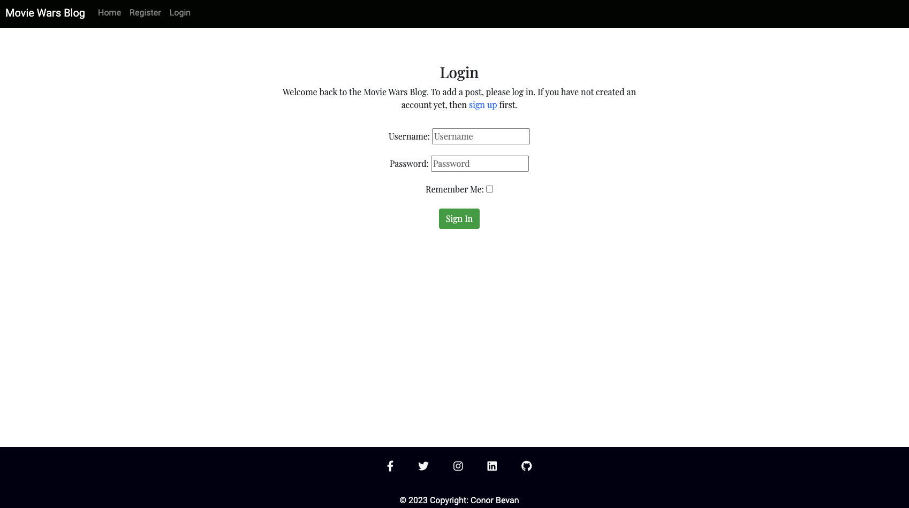
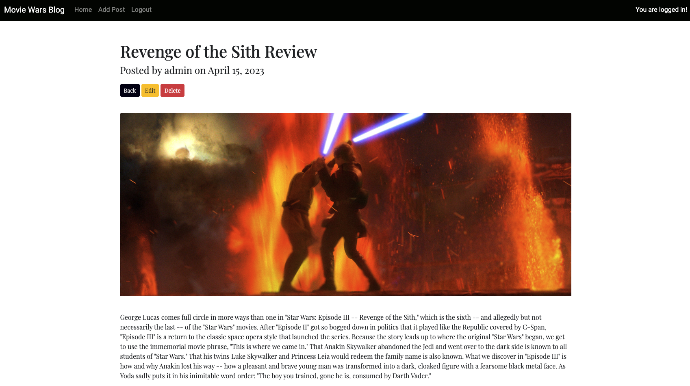
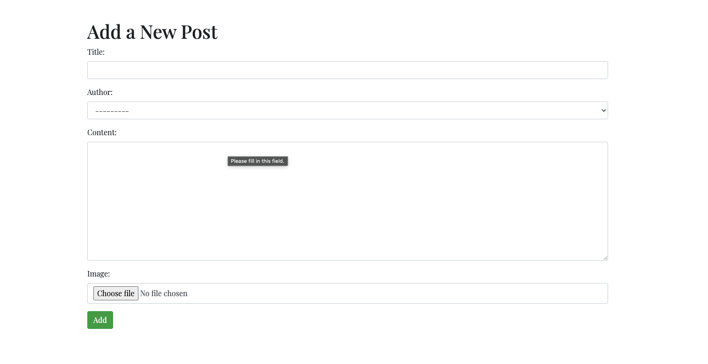

# Welcome to [Movie Wars Blog](https://movie-wars-blog.herokuapp.com/)

The Movie Wars Blog website is a responsive website that can be view on a range of devices. The purpose of the site is to allow visitors to view and create movie reviews.

You can view the deployed site here: [Delployed Site](https://movie-wars-blog.herokuapp.com/)

- - - 

## Contents

* [User Experience](#User-Experience)
* [Design](#Design)
* [Site Features](#Site-Features)
* [Technologies Used](#Technologies-Used)
* [Testing](#Testing)
* [Deployment](#Deployment)
* [Credits](#Credits)

- - -

## User Experience

### User Stories

As a website user, I can:

1. Navigate around the site and easily view the desired content.
2. View a list of blogs and choose accoirdingly.
3. Click on post to read the blog details.
4. Register for an account to get the perks offered to signed up users.

As logged in website user, I can:

1. View blogs
2. Add posts
3. Edits posts
4. Delete posts
5. Logout from the website.

As a website superuser, I can:

1. Create and publish new blogs
2. Edit and delete new blogs
3. Delete user accounts 

### Agile Methodology

All functionality and development of this project were managed using GitHub which Projects can be found
[here](https://github.com/ConorBevan/MovieWarsBlog/issues)

### The Scope - Main Site Goals

* To provide users with a good experience when using the website.
* To provide users with a visually pleasing website that is intuitive to use and easy to navigate.
* To provide a website with a clear purpose.
* To provide role-based permissions that allows user to interact with.

- - -

## Design

### Colour Scheme

I wanted to keep the colour scheme in a formal/newpaper style. The colour palette is used is here: [coolors](https://coolors.co/000100-a1a6b4-94c5cc-b4d2e7-f8f8f8)

### Typography

Google Fonts was used for the following fonts:

* Playfair is used for the body on the site.

* Roboto is used for the navbar and footer on the site. 

### Imagery

All blog header images were taken from the publishers websites. I have credited these in the credits section. They are uploaded to cloudinary storage.

### Wireframes

Wireframes were created for mobile and desktop here: [Home Page Wireframe](./assets/readme/wireframe.png)

### Database Model

Linked Here: [Database Diagram](./assets/readme/database.png)

- - - 

## Site Features

The website is comprised of five pages, three of which are accessible when not logged in and other two appear when logged in (Homepage, Register, Login, Add Post, Logout).

* All Pages on the website have:
  * A responsive navigation bar at the top which allows the user to navigate through the site. In the left of the navigation bar is the Movie Wars Blog logo. Beside the logo in the navigation bar are the links to the websites pages (home, add post, register, login and logout).
  In the top right of the navbar when logged in is a message letting you know you are logged in. 
  * A footer which contains social media icon links to Instagram, Facebook, LinkedIn, Twitter and Github. There is also a copyright mark underneath the icons.

 ### Home Page

 

  * Page Title
  This states you are on the blog post section. Also a small about us section underneath the homepage title to let users know what the site is about.
  * Blog Posts
  This section is where the list of all the blogs/reviews are uploaded to the site.

### Register Page

  * This section is where new users can register to access hidden features in the site. Such as adding, editing and deleting posts.

### Login Page

  * This section is where new users can login to acces the hidden features in the site.

### Blog Deatils Page

  * This section is where a user can view the contents of a blog which includes title, author, date posted, header image and content. If a user is logged in they will be able to edit and delete blog posts.

### Add Post Page

  * This section is where logged in users can create a blog post with a title, author, content and image.

### Edit Post Page

  * This section is where logged in users can edit the blog of their choice and change the title, author, content and image. 

### Delete Post Page

  * This section is where logged in users can delete a blog.

### Logout Page

  * This section is where users can logout of their accounts. 

### Admin Panel

  * This section is where as a admin/superuser I have full access to CRUD functionality so I can view, create, edit and delete posts.

### Future Implementations.
  * Only allow a user to edit and delete posts that they created. 

### Accessibility

I have been mindful during coding to ensure that the website is as accessible and friendly as possible. I have achieved this by:

* Using semantic HTML.
* Using descriptive alt attributes on images on the site.
* Ensuring that there is a sufficient colour contrast throughout the site.

- - -

## Technologies Used

### Languages Used

* [HTML 5](https://en.wikipedia.org/wiki/HTML/)
* [CSS 3](https://en.wikipedia.org/wiki/CSS)
* [JavaScript](https://www.javascript.com/)
* [Django](https://www.python.org/)
* [Python](https://www.djangoproject.com/)

### Frameworks, Libraries & Packages Used

* Git - For version control.
* Github - To save and store the files for the website.
* Bootstrap - Framework used to style the site. 
* Google Fonts - To import the fonts used on the website.
* Font Awesome - For the iconography on the website.
* Gunicorn - As the server for Heroku.
* Cloudinary - Used to host media.
* Psycopg2 - As an adaptor for Python and PostgreSQL databases.
* Django Allauth - For authentication, registration, account management.

- - -

## Testing

Testing was conducted continuously throughout the development of this project. More details, please refer to [TESTING.md](TESTING.md) file.

- - -

## Deployment

### Creating the Django app

1. Go to the Code Institute Gitpod Full [Template.](https://github.com/Code-Institute-Org/gitpod-full-template).
2. Click on Use This Template.
3. Once the template is available in your repository click on Gitpod.
4. When the image for the template and the Gitpod are ready open a new terminal to start a new Django App.
5. Install Django and gunicorn: `pip3 install django gunicorn`.
6. Install supporting database libraries dj_database_url and psycopg2 library: `pip3 install dj_database_url psycopg2`.
7. Create file for requirements: in the terminal window type `pip freeze --local > requirements.txt`.
8. Create project: in the terminal window type django-admin startproject your_project_name.
9. Create app: in the terminal window type python3 manage.py startapp your_app_name.
10. Add app to the list of installed apps in settings.py file: you_app_name.
11. Migrate changes: in the terminal window type python3 manage.py migrate.
12. Run the server to test if the app is installed, in the terminal window type python3 manage.py runserver.

### Deployment of This Project

1. Log in to [Heroku](https://id.heroku.com) or create an account.
2. On the main page click the button labelled New in the top right corner and from the drop-down menu select Create New App.
3. You must enter a unique app name.
4. Next select your region.
5. Click on the Create App button.
6. Click in resources and select Heroku Postgres database.
7. Add your config vars.
8. The next page is the project’s Deploy Tab. Click on the Settings Tab and scroll down to Config Vars.
9. Next, scroll down to the Buildpack section click Add Buildpack select python and click Save Changes.
10. Scroll to the top of the page and choose the Deploy tab.
11. Select Github as the deployment method.
12. Confirm you want to connect to GitHub.
13. Search for the repository name and click the connect button.
14. Scroll to the bottom of the deploy page and select the preferred deployment type.
15. Click either Enable Automatic Deploys for automatic deployment when you push updates to Github.

### Final Deployment 

1. When development is complete change the debug setting to: `DEBUG = False` in settings.py.
2. In this project if summernote editor was used for this to work in Heroku add: `X_FRAME_OPTIONS = SAMEORIGIN` to settings.py.
3. In Heroku settings, delete the config vars for `DISABLE_COLLECTSTATIC = 1`.

### Forking This Project

1. Open [GitHub.](https://github.com/ConorBevan/MovieWarsBlog)
2. Find the 'Fork' button at the top right of the page.
3. Once you click the button the fork will be in your repository.

### Cloning This Project

1. Open [GitHub.](https://github.com/ConorBevan/MovieWarsBlog)
2. You will be provided with three options to choose from, HTTPS, SSH or GitHub CLI, click the clipboard icon in order to copy the URL.
3. Once you click the button the fork will be in your repository.
4. Open a new terminal.
5. Change the current working directory to the location that you want the cloned directory.
6. Type 'git clone' and paste the URL copied in step 3.
7. Press 'Enter' and the project is cloned.

### Note

I had a lot of issues when deploying this project due to an etag error. I had to use the full length of my mentor session and a whole evening of tutor assistance to try and reslove the isuuse at hand. 

- - - 

## Credits

### Content

* All the blog content was taken from [Robert Ebert. ](https://www.rogerebert.com/)
* The images were taken from the images used in [Robert Ebert ](https://www.rogerebert.com/) reviews.

### Information Sources / Resources

* [W3Schools - Python](https://www.w3schools.com/python/)
* [Stack Overflow](https://stackoverflow.com/)
* [Django Project](https://www.djangoproject.com/)
* [Idea of using Cards](https://www.youtube.com/watch?v=PwEvMY7nnY8)

