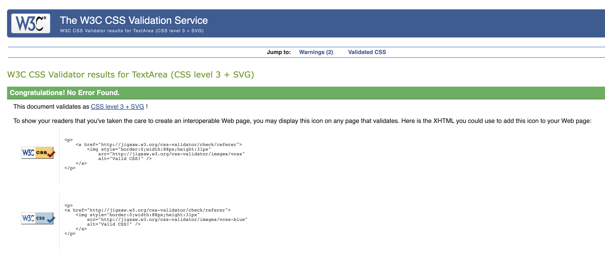

# Testing
Back to the [README](README.md)

Testing took place place continuously throughout the development of the project.

### Python Validation - PEP8
Python testing was done using the PEP8 Online to ensure there were no syntax errors in the project. All python files
were entered into the online checker and no errors were found in any of the custom codes.

#### MovieWarsBlog - blog
* [admin.py](./assets/testme/blog-pep8-admin)
* [apps.py](./assets/testme/blog-pep8-apps)
* [forms.py](./assets/testme/blog-pep8-forms)
* [models.py](./assets/testme/blog-pep8-models)
* [tests.py](./assets/testme/blog-pep8-tests)
* [urls.py](./assets/testme/blog-pep8-urls)
* [views.py](./assets/testme/blog-pep8-views)

#### MovieWarsBlog - moviewars
* [asgi.py](./assets/testme/moviewars-pep8-asgi)
* [settings.py](./assets/testme/moviewars-pep8-settings)
* [urls.py](./assets/testme/moviewars-pep8-urls)
* [wsgi.py](./assets/testme/moviewars-pep8-wsgi)

### Lighthouse
Lighthouse was used to test Performance, Best Practices, Accessibility and SEO. 

##### Results:

### HTML Validation

### CSS Validation

## Manual Testing

### Frontend
* The Signup, Login and Logout system has no issues and is working.
* The Blog posts page is working properly. It display information and you can interact with blog posts. 
* All the internal links are working and bring the user to the right page on the website.
* All the external links are working and bring the user to the right social media page by 
  opening a new browser tab.
* The drop-down menu in the navbar when using mobile works.
* The pagination system is working. It adds another page after 6 posts on the page.
* On the Post Details Page, if you are not logged in only back button is displayed to return to homepage. If you are logged in edit and delete button appear 
  and are working threy bring you to the correct page.  
* The functionality to delete a post is working without issues. 
* The functionality to update a post is working without issues. Allows user to update the title, author, blog content and image.
* The CRUD functionality is working without issues.

### Backend/Admin Panel
* I have tested the Admin Panel repeatedly since the start of the project development and is working wiht no issues.
* When an author is posting a new blog all, it can be edited and deleted in the admin panel.

## Bugs

* While I was developing the project I tried to add a blog image to my posts but was only displaying the placholder image. By adding an enctype to the form it fixed this issue. 
* While deploying I had major issues wth an etag that wouldnt let me deploy my project to heroku. After a lot of testing and editing I removed django ckeditor from my blog code entirely and the issue seems to have been resolved.